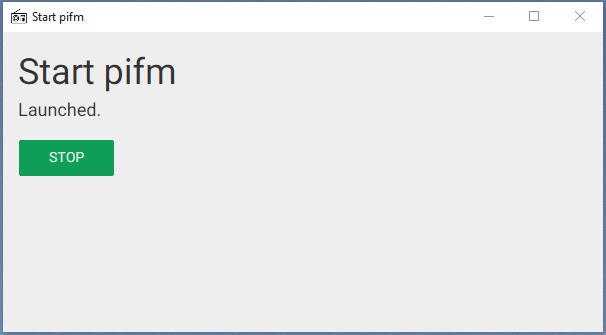

# Start pifm

A  software to start [pifm-node](https://github.com/cedced19/pifm-node) (or [pifm-browser](https://github.com/cedced19/pifm-browser)) faster from desktop.

## Installation

1. [Download](https://github.com/cedced19/start-pifm/releases/latest)
2. Extract
3. Execute `start-pifm.exe`



## To compile

```
npm install
gulp
```
